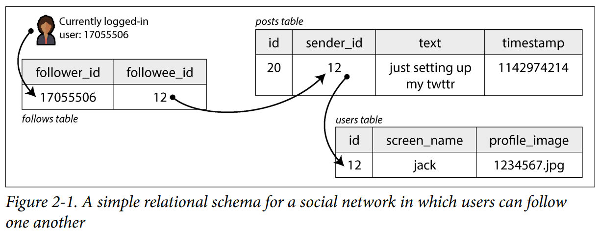
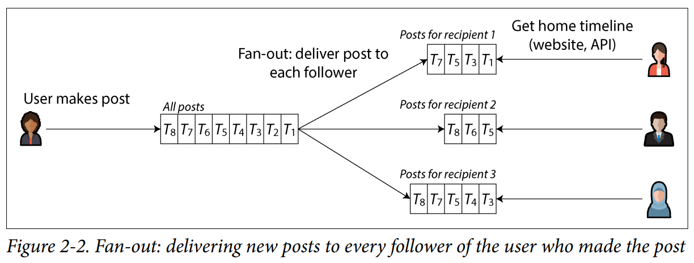
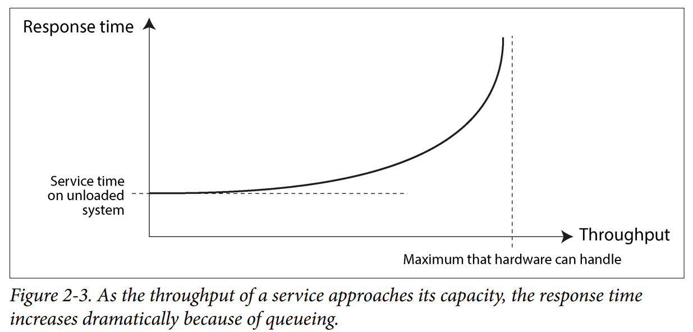

# Chapter 2: Defining Nonfunctional Requirements

**Functional Requirements**
- Which screens & buttons to add
- APIs & data processing
- User authentication

**Nonfunctional Requirements**
- App should be fast & reliable
- Secure & legally compliant
- Easy to maintain

**This chapter covers**
- Defining & measuring the performance of a system
- What it means for service to be reliable (Will it continue to work when things go wrong?)
- Scalable systems and efficient ways to add compute
- Maintaining a system long term easily


## Case study: Social Network Home Timelines
> Implement X

**Basic functions**
- User can post messages
- User can follow other users

**Scale**
- Users make 500 million posts per day
- On average, 5,800 posts per second
- On special occasions, 150,000 posts per second

**Average user**
- Has 200 followers
- Follows 200 people
	- Some are celebrities with 100 million followers

### Representing Users, Posts, Follows

Store data in **relational database**
- Table 1: Users
- Table 2: Posts
- Table 3: Follow relationships



**Home timeline** is the **main read operation**
- Display recent posts from following
- (Ignore algorithmic feed, ads, suggested posts)

Use SQL query to get home timeline for a user
- Use `follows` table to find everybody who `current_user` is following
- Look up recent posts by those users
- Sort them by timestamp
- Get most recent 1,000 posts

```sql
SELECT posts.*, users.* FROM posts
	JOIN follows ON posts.sender_id = follows.followee_id
	JOIN users ON posts.sender_id = users.id
	WHERE follows.follower_id = current_user
	ORDER BY posts.timestamp DESC
	LIMIT 1000
```


Followers should see new posts within five seconds
- **Approach 1: Polling**
	- While the user is online, client repeats the query every 5 seconds
	- If 10 million users are online
		- **2 million queries per second**
	- If all users follow 200 people
		- query needs to fetch posts by 200 people
		- 2 million queries x 200 followed accounts = **400 million lookups per second**
	- Some users follow 10K+, 100K+ people
		- Query is expensive & slow


### Materializing and Updating Timelines

**Approach 2**
- Server actively pushes new posts to followers
	- For each user, store a data structure containing their home timeline
	- User makes a post -> look up their followers -> insert post into follower's home timeline

- Serve home timeline from cache by precomputing the results of the query
	- User logs in -> return precomputed timeline from cache
	- Enable notification -> subscribe to the stream of posts

- In case of post spikes, can accept that posts take longer to show up on timeline
	- Enqueue posts rather than delivering immediately
	- Timeline itself still loads fast

**Downside**
- When user makes a post, server needs to do more work
	- One initial request -> several downstream requests
- ***Fan-out***: the factor by which number of requests increases
	- 5,800 posts per second x 200 followers = **1 million+ home timeline writes per second**
	- Heavy. But better than 400 million lookups per second




Materialized view

- **Materialization**: process of precomputing & updating the results of a query
- **Materialized view**:
	- Speeds up reads, but a lot more work on writes
	- e.g. timeline cache


Extreme cases:
* User is following a large number of accounts & those accounts post a lot
	* Problem: User has high rate of writes to their materialized timeline
	* Solution: Acceptable to drop some writes
* Celebrity account with 10M followers posted
	* Problem: A lot of write work. Do not want to drop some writes.
	* Solution: Handle celebrity posts separately from regular users
		* Store celebrity posts separately
		* Merge with materialized timeline on read


## Describing Performance

- **Response time**: elapsed time between user makes a request and user receives a response
	- e.g. "time it takes to load the home timeline", "time until a post is delivered to followers"

- **Throughput**: # of requests per second or data volume per second that the system is processing
	- Hardware resources have maximum throughput
	- Unit of measurement is "x per second"
	- e.g. "posts per second", "timeline writes per second"

- Throughput and response time are related
	- Response time increases as load increases
	- Queueing:
		- Request arrives on highly loaded system
		- CPU is handling earlier request
		- Incoming request needs to wait





### When an overloaded system won't recover
System can enter a vicious cycle where it becomes less efficient and even more overloaded
- Gets worse when clients time out and resend their requests
- "Retry storm" overloads overloaded system, causing "metastable failure"
	- Need reboot or reset the system

Solutions
- Exponential backoff
	- Increase & randomize time between retries
- Circuit breaker / token bucket algorithm
	- If failure rate crosses a specific threshold, blocks all subsequent traffic
		- e.g. 50% of the last 100 requests failed
		- Middleman returns instant error message to client
- Load shedding:
	- reject requests instead of processing them
		- e.g. HTTP 503 Service Unavailable
- Backpressure
	- Downstream tells upstream to slow down the rate of requests

## Latency and Response time

- **Response time**: what client sees
- **Service time**: duration when service is actively processing client's request
- **Queueing delays**: can occur at several points
	- Waiting until CPU is available
	- Buffering response packet over busy network
- **Latency**: duration when request is NOT being actively processed
- **Head-of-line blocking**: Small number of slow requests can hold up the subsequent requests


Response time can vary with random delays
- Context switch to background process
- Loss of network packet -> TCP retransmission
- Garbage collection pause
- Page fault forcing a read from disk
- Mechanical vibrations in the server deck...


## Average, Median, and Percentiles
(ms: milliseconds)

- Response time can vary
	- Need to measure from client side
	- Measure as a *distribution* of values


- *Average* response time is not a good metric
	- Doesn't tell you how many users experienced delay

- Percentiles is the better / common metric
	- Sort response times from fastest -> slowest
	- **p50**, also the median
		- If median is 200ms, half of requests took less than 200ms
		- And the other half took longer
	- **p95**
		- 95th percentile response time: 1.5s
		- 95 out of 100 requests took less than 1.5s
	- **p99**
	- **p999**, 99.9%

- High percentiles, i.e. tail latencies, directly impact user experience
- For Amazon,
	- customers with slowest requests had most data on their accounts
	- Valuable customers who had made most purchases
- NOT optimizing for 99.99 is deemed acceptable due to diminishing returns

## Use of Response Time Metrics

- High percentiles
	- important in backend services that are **called multiple times** as part of a **single end-user request**
- User response time significantly increased
	- Request needs to wait for the slowest of the parallel calls
	- individual backend services perform perfectly but hit tail latency (e.g., p99) only 1% of the time
- **Tail latency amplification**
	- rare, slow individual component delays (the "tail") become highly magnified at the system level
	- a phenomenon in distributed systems

- Percentiles are used in
	- **Service level objectives (SLOs)**
		- Example target:
			- median response time of less than 200 ms
			- 99th percentile under 1 second
			- 99.9% of valid requests in non-error responses
	- **Service level agreements (SLAs)**
		- Contract that specified what happens if SLO is not met
		- Example:
			- Customers entitled to a refund


### Computing Percentiles

## Reliability and Fault Tolerance

- Typical software expectation
	- Perform the function user expected
	- Tolerate the user making mistakes
	- Good enough performance for expected load and data volume
	- Prevent unauthorized access / abuse

- **Fault**: particular part of a system stops working
	- Single hard drive malfunction, single machine crash, etc

- **Failure**: System as a whole stops providing required service. Did not meet SLO.

- Fault vs. Failure
	- If the system consists of a single hard drive that stopped -> failed
	- If system consists of multiple hard drive -> fault


### Fault Tolerance

- Fault-tolerant system can continue to provide required service to users despite faults
- Social network example:
	- Machine that writes to timelines crashed during fan-out process
		- Fan-out process: writing to timelines after a user posts
	- Ensure another machine can take over
		- Without missing any posts
		- Without duplicating any posts, i.e. exactly-once semantics

- Fault injection testing / chaos engineering
	- Deliberately introduce errors / faults to evaluate how it responds

### Hardware and Software Faults

- Approx 2 - 5% of magnetic hard drives fail per year
- Approx 0.5 - 1% of solid state drives (SSDs) fail per year
- Approx 1 in 1,000 machines has a CPU core that computes the wrong result occasionally
- Data in RAM can be corrupted
- Entire datacenter might become unavailable

### Tolerating hardware faults through redundancy
Unreliable hardware?
- Add redundancy to individual hardware components to reduce failure rate
	- RAID configuration:
		- spread data across multiple disks
		- prevent a failed disk from causing data loss
	- Dual power supplies for servers
	- Hot-swappable CPUs
	- Batteries, diesel generators for backup power in datacenters

Effective redundancy
- Redundancy is most effective when faults are independent
	- where one fault does not change the likelihood of another fault occurring
- BUT component failures have significant correlations

Distributed systems
- Can tolerate hardware failures
- Cloud systems focus less on machine reliability
	- More on software fault tolerance
- Availability zones: identify which resources are physically co-located
	- Resources in the same space more likely to fail together
	- Datacenter A machine failed -> datacenter B machine takes over
- Operational advantages
	- Rolling upgrade
	- Reboot the machine one at a time

### Software Faults

- Hardware failures are weakly correlated
	- If one disk fails, other disk is likely fine
- Software failures are highly correlated
	- Series of bugs resulting in data loss
	- Service dependency resulting in corrupted responses
	- Integration bugs
	- Cascading failures
- Such bugs are hard to find, and lie dormant for a long time

Do lots of small things
- careful planning on assumptions & interactions
- thorough testing
- process isolation
- let processes crash & restart
- avoid feedback loops
- measuring
- monitoring...

### Humans and Reliability
Postmortems
- Blaming people for mistakes is counterproductive
- Host blameless postmortems
	- Share details of incidents to prevent similar issues in the future

Minimize impact
- thorough testing
- rollback mechanism
- gradual code rollout
- detailed & clear monitoring

How important is reliability?
- Can lead to lost productivity
- Lost revenue
- Permanent data loss

## Scalability
- Increased load is a common reason for degradation
- Ability to cope with increased load

Asking the right questions
- What are our options to scale?
- How to add computing resources to handle more load?
- When will we hit the limits?

### Understanding Load
### Shared-Memory, Shared-Disk, and Shared-Nothing Architectures
### Principles for Scalability

## Maintainability
### Operability: Making Life Easy for Operations

### Simplicity: Managing Complexity
### Evolvability: Making Change Easy

## Summary